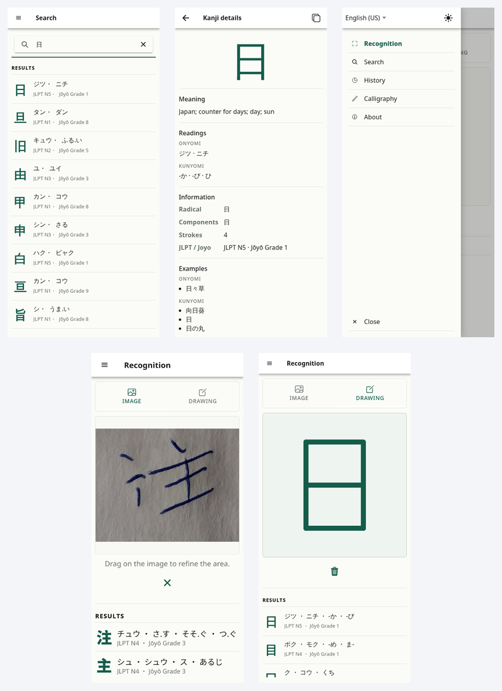

# KanjiMe

<p align="center">
  <a href="https://www.typescriptlang.org/" target="_blank">
    
  </a>
  <a href="https://react.dev/" target="_blank">
    
  </a>
  <a href="https://ionicframework.com/" target="_blank">
    
  </a>
  <a href="https://capacitorjs.com/" target="_blank">
    
  </a>
  <a href="https://firebase.google.com/" target="_blank">
    
  </a>
  <a href="https://onnxruntime.ai/" target="_blank">
    
  </a>
  <a href="https://opencv.org/" target="_blank">
    
  </a>
  <a href="https://vitest.dev/" target="_blank">
    
  </a>
  <a href="https://playwright.dev/" target="_blank">
    
  </a>
  <a href="https://www.ulpgc.es" target="_blank">
    
  </a>
</p>

<p align="center"><strong>Final Degree Project · Computer Science · ULPGC</strong></p>

KanjiMe is an offline-first kanji learning platform developed as a Final Degree
Project (TFG). It combines on-device character recognition, dictionary search,
and calligraphy practice in a mobile app, with a separate administration panel
for version management and error-report support.

<p align="center">
  
</p>

## Academic Information

This repository is part of a Final Degree Project in Computer Science developed at the University of Las Palmas de Gran Canaria.

| |  |
| --- | --- |
| Student | Tycho Quintana Santana |
| Student contact | tycho.quintana@gmail.com |
| Supervisor | José María Quinteiro González |
| Degree | Computer Science |
| School | [Escuela de Ingeniería Informática](https://www.eii.ulpgc.es/es) |
| University | [Universidad de Las Palmas de Gran Canaria](https://www.ulpgc.es/) |

## Applications

- [Mobile application](apps/mobile) — Ionic React app for recognition, search,
  study, and calligraphy practice.
- [Administration panel](apps/admin) — Technical-support interface for error
  reports and version configuration.
- [Shared package](packages/shared) — Types and utilities used by both
  applications.

## Repository Structure

KanjiMe uses npm workspaces to keep both applications and their shared code in
one monorepo.

| Path | Purpose |
| --- | --- |
| `apps/mobile` | Mobile application and its Capacitor native projects |
| `apps/admin` | Web administration panel |
| `packages/shared` | Shared TypeScript types and utilities |
| `docs` | User documentation and README images |

## Technology Stack

| Area | Technologies |
| --- | --- |
| Interface | React, Ionic React, TypeScript |
| Mobile runtime | Capacitor |
| Recognition and evaluation | ONNX Runtime Web, OpenCV.js |
| Local data | SQLite |
| Remote services | Firebase Auth, Firestore |
| Tooling and tests | Vite, Vitest, Playwright |

## Prerequisites

- Node.js 22 LTS
- npm 10
- JDK 21 and Android Studio for Android builds
- Xcode and macOS for iOS builds

## Installation

Clone the repository with its OpenCV submodule, install all workspaces, and
generate the packaged database:

```bash
git clone --recurse-submodules <repository-url>
cd kanjime
npm install
npm run data:prepare
```

The database generation task downloads the required public sources and creates
the SQLite asset used by the mobile application.

## Development

| Task | Command |
| --- | --- |
| Start mobile app | `npm run dev:mobile` |
| Start admin panel | `npm run dev:admin` |
| Watch shared package | `npm run dev:shared` |
| Build all workspaces | `npm run build` |
| Build Android app | `npm run build:android` |
| Lint all workspaces | `npm run lint` |
| Run unit and integration tests | `npm run test` |
| Run end-to-end tests | `npm run test:e2e` |

Workspace-specific commands and setup details are documented in the
[mobile](apps/mobile) and [admin](apps/admin) READMEs.

## Testing

Vitest covers unit and integration behavior. Playwright verifies complete
browser flows for both applications.

```bash
npm run test:unit
npm run test:integration
npm run test:e2e
```

## Data Attribution

The packaged local database contains project-specific transformations derived
from:

- [JMdict](https://www.edrdg.org/wiki/index.php/JMdict-EDICT_Dictionary_Project)
  by the Electronic Dictionary Research and Development Group (EDRDG)
- [KANJIDIC2](https://www.edrdg.org/wiki/index.php/KANJIDIC_Project) by EDRDG
- [KanjiVG](https://kanjivg.tagaini.net/) by the KanjiVG contributors
- [Tanos JLPT Kanji Lists](https://www.tanos.co.uk/jlpt/skills/kanji/) by
  Jonathan Waller

The recognition model was trained with
[ETL9B](https://etlcdb.db.aist.go.jp/?lang=en), part of the ETL Character
Database maintained by the National Institute of Advanced Industrial Science
and Technology (AIST), Japan.

Original datasets are not redistributed directly and remain subject to their
respective licences and attribution requirements.

## Academic Context

|  |  |
| --- | --- |
| Project | KanjiMe |
| Author | Tycho Quintana Santana |
| Programme | Computer Science, ULPGC |
| Type | Final Degree Project (TFT) |

## Copyright

All rights reserved unless otherwise stated.
