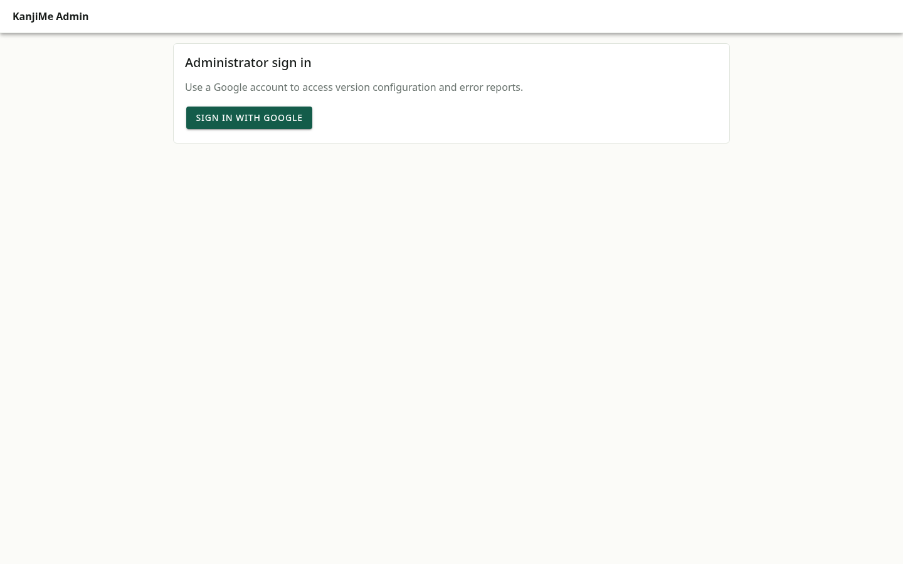
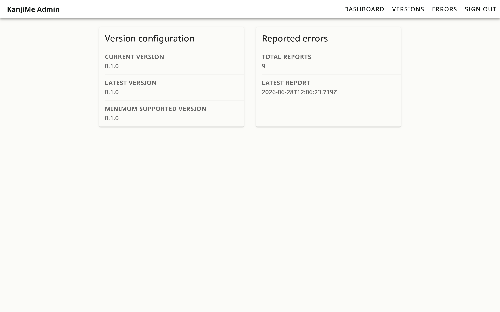
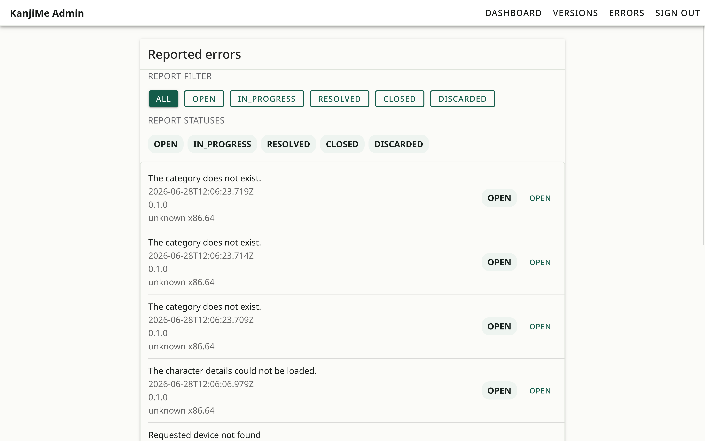
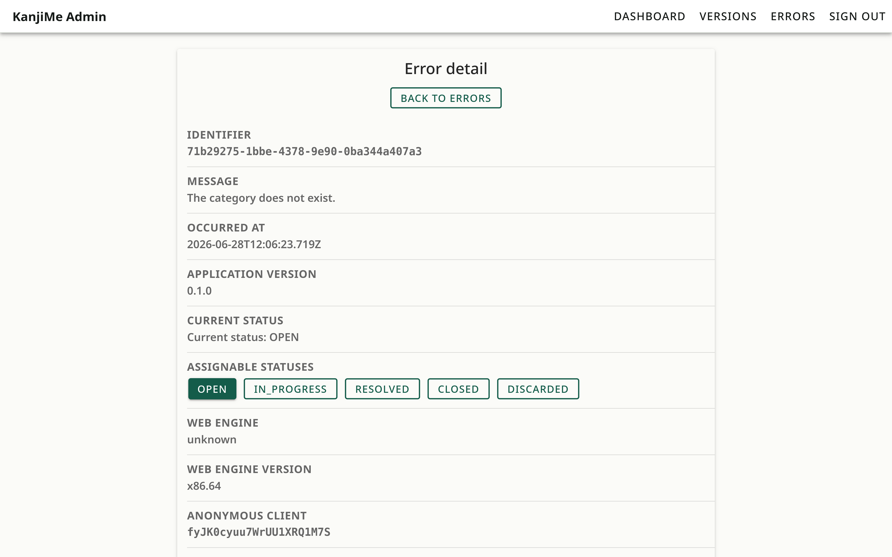
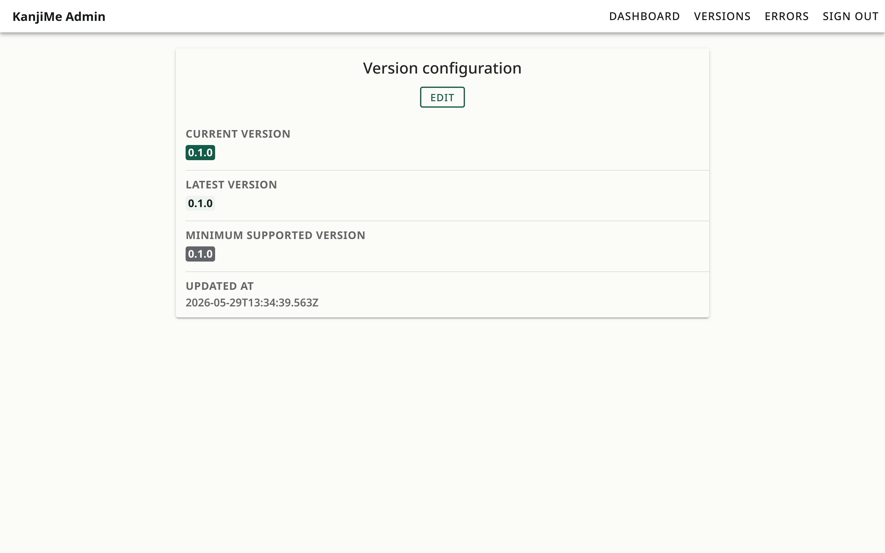

# KanjiMe Admin

## Description

KanjiMe Admin is the technical-support panel for the KanjiMe project. It gives
authorised administrators access to mobile error reports and remote version
configuration without mixing administration logic into the mobile app.

## Features

### Authentication

Google Sign-In through Firebase Auth protects all administration routes and
administration data.

<p align="center">
  
</p>

### Dashboard

The protected dashboard summarises support activity and links to error reports
and version management.

<p align="center">
  
</p>

### Error Reports

Administrators can filter reports by lifecycle status, inspect runtime context,
and move cases between open, in-progress, resolved, closed, and discarded
states.

<p align="center">
  
</p>

Each detail view presents the selected report, its current support status, and
available recent user actions.

<p align="center">
  
</p>

### Version Management

Version configuration defines the current, latest, and minimum supported mobile
releases. The mobile app consumes this configuration to show optional or
required update states.

<p align="center">
  
</p>

## Architecture

The admin workspace follows a feature-oriented architecture.

`createAdminCompositionRoot()` assembles the application dependencies and injects
only the contracts required by each feature. Firestore access is isolated behind
the observability repository, while authentication is handled through a dedicated
authentication client. Deterministic substitutes are used during end-to-end
testing, keeping feature code independent from Firebase implementation details.

## Technology Stack

| Area | Technologies |
| --- | --- |
| Interface | React, Ionic React, TypeScript |
| Build | Vite |
| Authentication and data | Firebase Auth, Firestore |
| Testing | Vitest, Playwright, Testing Library |

## Installation and Development

Install monorepo dependencies from the repository root:

```bash
npm install
```

Run these workspace commands from `apps/admin`:

| Task | Command |
| --- | --- |
| Development server | `npm run dev` |
| Production build | `npm run build` |
| Local preview | `npm run preview` |
| Unit tests | `npm run test:unit` |
| Integration tests | `npm run test:integration` |
| End-to-end tests | `npm run test:e2e` |

## Firebase Configuration

Create `apps/admin/.env` with the Firebase client variables required by
`src/Shared/FirebaseClient.ts`:

```dotenv
VITE_FIREBASE_API_KEY=
VITE_FIREBASE_AUTH_DOMAIN=
VITE_FIREBASE_PROJECT_ID=
VITE_FIREBASE_STORAGE_BUCKET=
VITE_FIREBASE_MESSAGING_SENDER_ID=
VITE_FIREBASE_APP_ID=
```

Keep real environment values outside documentation and version control.

## Testing

Vitest covers feature logic, regressions, views, and integration scenarios.

Playwright verifies the protected administration flows against the production
preview, including authentication, dashboard navigation, error report filtering,
error detail updates, and version configuration.

E2E substitutes are wired through the composition root and the shared support
infrastructure when `VITE_ENABLE_E2E_MOCKS=true`, preserving normal production
behavior.