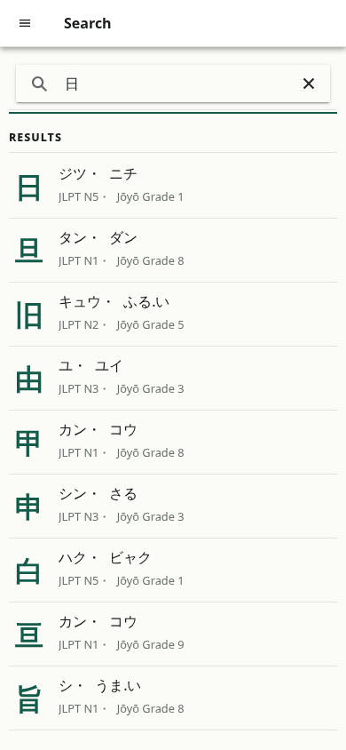
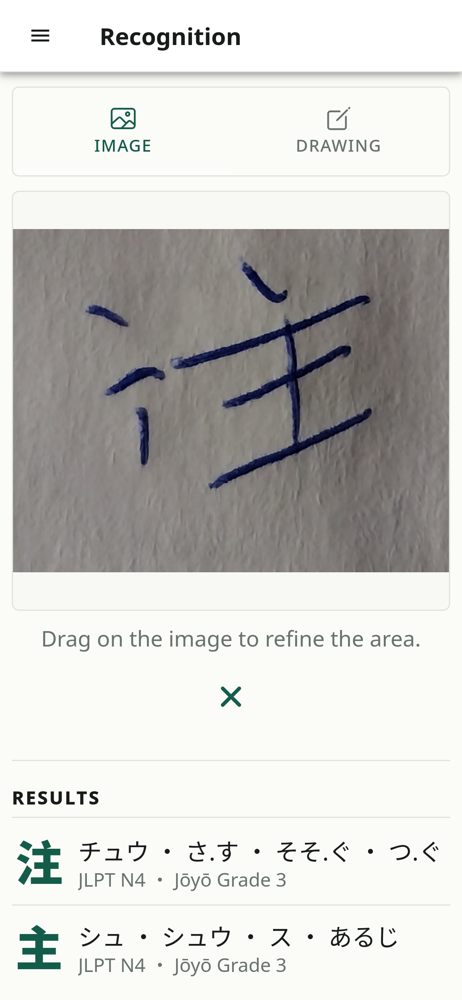
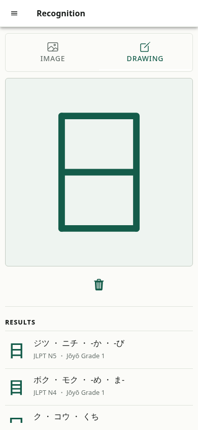
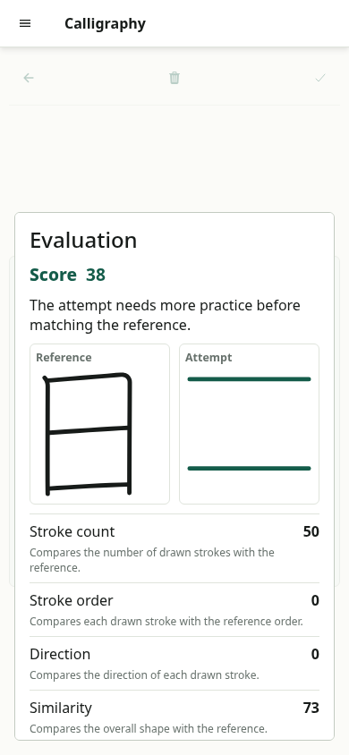
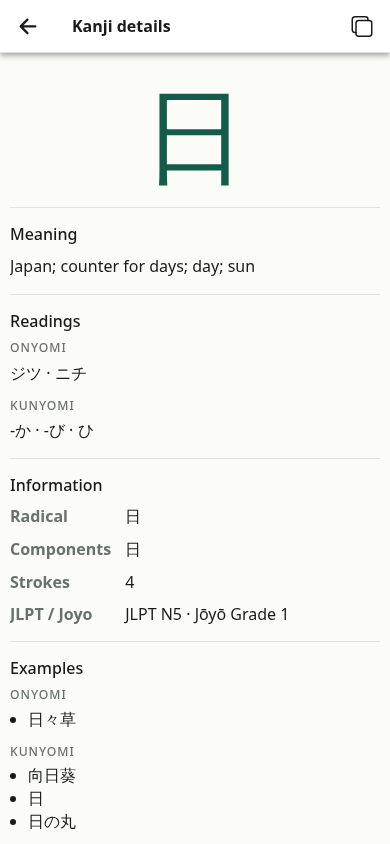
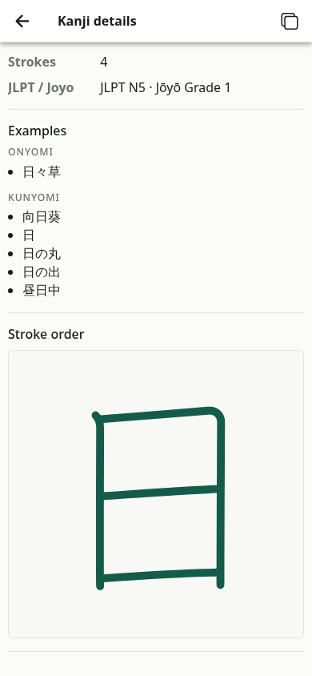
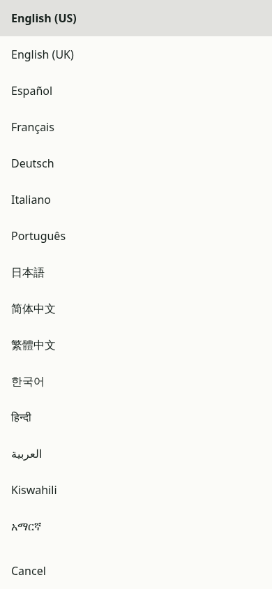
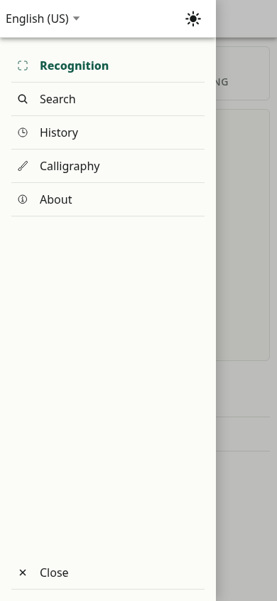
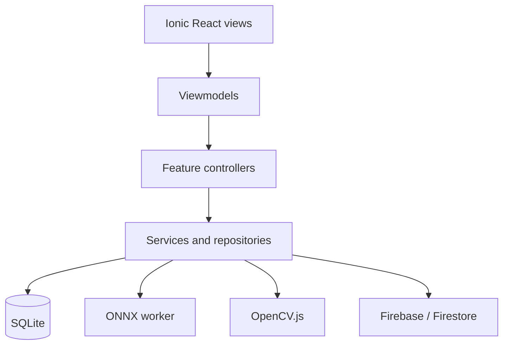

# KanjiMe Mobile

## Description

KanjiMe Mobile is the main application of the KanjiMe Final Degree Project. It
is an offline-first Ionic React app for kanji recognition, reference lookup,
and handwriting practice on Android, iOS, and the web.

## Features

### Search

Search the packaged dictionary by kanji or reading. Results show each
character's principal readings and available JLPT or Joyo levels.

<p align="center">
  
</p>

### Classification

Recognise kanji from a camera photo or stored image. Users can refine the input
with a crop selection before ONNX Runtime Web returns ordered candidates.

<p align="center">
  
</p>

### Drawing

Draw a character directly on the canvas and classify it with the same local
recognition model. Results are ordered by confidence without displaying numeric
scores.

<p align="center">
  
</p>

### Calligraphy

Practise characters selected by JLPT level or Joyo grade. Evaluation compares
the attempt with KanjiVG reference data and reports stroke and shape feedback.

<p align="center">
  
</p>

### Kanji Details

Open a complete dictionary entry with meanings, readings, examples, radical,
components, stroke count, classification levels, and stroke order. Missing
fields are omitted.

<p align="center">
  
  
</p>

### History

Review previous searches, visited entries, image classifications, and drawing
classifications. History stays on the device.

<p align="center">
  
</p>

### Preferences

Choose the interface language and light or dark theme. Preferences persist in
native SQLite on mobile and local storage on the web.

<p align="center">
  
  
</p>

### Supporting Features

- Version checks distinguish optional updates from unsupported releases.
- Unexpected errors produce clear user feedback and can be queued for remote
  observability.
- About information includes version, authorship, licences, terms, and data
  acknowledgements.

## Architecture

The mobile application uses MVVM with a feature-oriented project structure.

Ionic views render state and forward user actions to viewmodels. Viewmodels
coordinate screen state and delegate operations to controllers, services,
repositories, and shared infrastructure.

The diagram below summarises the main architectural responsibilities and the
primary dependency flow.



`CompositionRoot.ts` assembles the main application dependencies and wires
feature contracts, persistence, inference, evaluation, and remote support.
Cross-feature infrastructure lives mainly under `src/Shared`.

## Technology Stack

| Area | Technologies |
| --- | --- |
| Interface | React, Ionic React, TypeScript |
| Mobile and web | Capacitor, Vite, Progressive Web App |
| Recognition | ONNX Runtime Web |
| Calligraphy evaluation | Custom OpenCV.js build with SIFT |
| Local data | Capacitor SQLite, sql.js, wanakana |
| Remote support | Firebase, Firestore |
| Testing | Vitest, Playwright, Testing Library |

## Data Sources

| Source | Purpose |
| --- | --- |
| JMdict | Reading examples and dictionary data |
| KANJIDIC2 | Meanings, readings, levels, radicals, and stroke counts |
| KanjiVG | Components and stroke-order references |
| Tanos JLPT | JLPT classification labels |
| ETL9B | Training data for the recognition model |

Generate the packaged database from the repository root:

```bash
npm run data:prepare
```

Original datasets remain subject to their respective licences and are not
redistributed directly.

## Supported Platforms

- Android through Capacitor
- iOS through Capacitor
- Progressive Web App

## Installation and Development

Install monorepo dependencies and prepare data from the repository root:

```bash
npm install
npm run data:prepare
```

Run these workspace commands from `apps/mobile`:

| Task | Command |
| --- | --- |
| Development server | `npm run dev` |
| Production web build | `npm run build` |
| Build, sync, and open Android project | `npm run build:android` |
| Unit tests | `npm run test:unit` |
| Integration tests | `npm run test:integration` |
| Coverage | `npm run test:coverage` |
| End-to-end tests | `npm run test:e2e` |

The Android command uses Capacitor's configured Android Studio launcher; no
machine-specific installation path is required in this documentation.

## Testing

Vitest covers logic, regressions, views, and integrations. 

Playwright verifies complete mobile flows with deterministic E2E substitutes activated by
`VITE_ENABLE_E2E_MOCKS=true`.

Dependencies are injected through feature factories and the composition root,
keeping production and test wiring separate.
